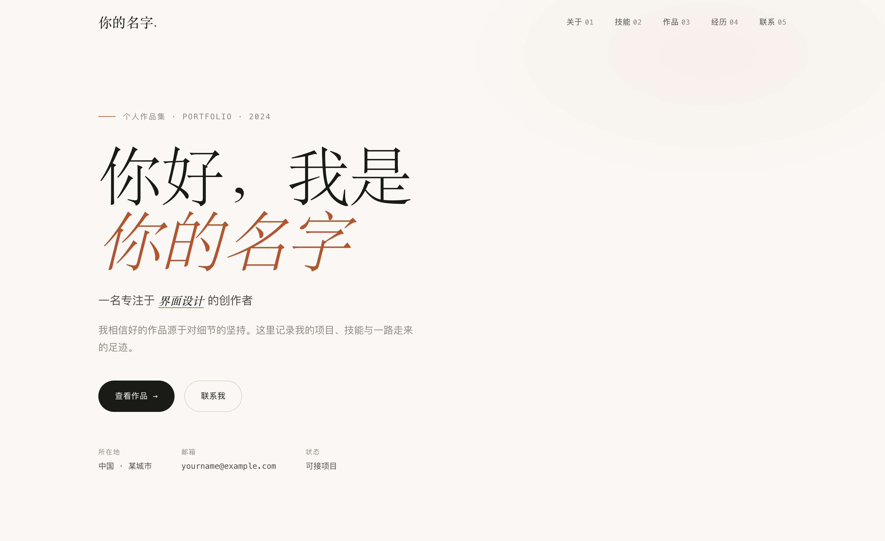
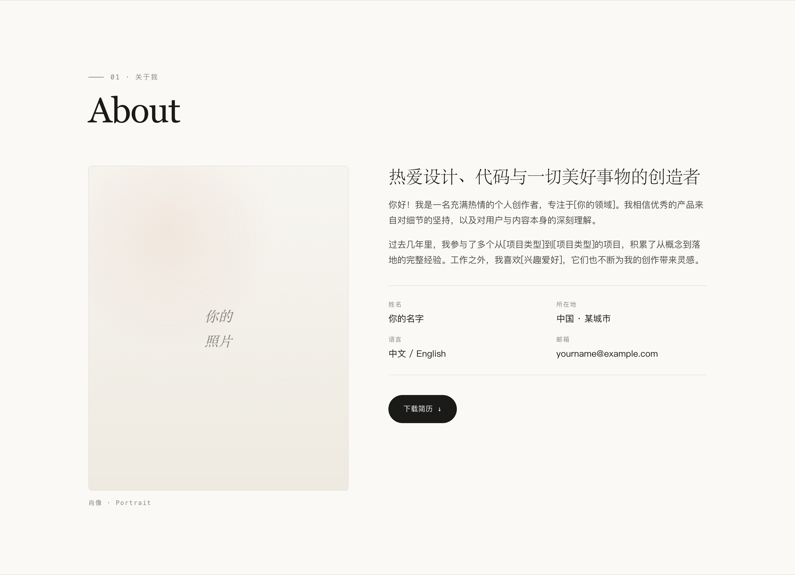
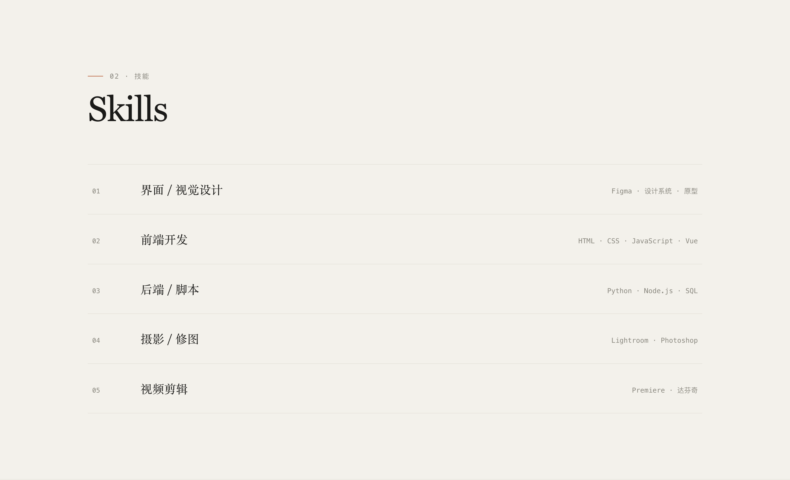
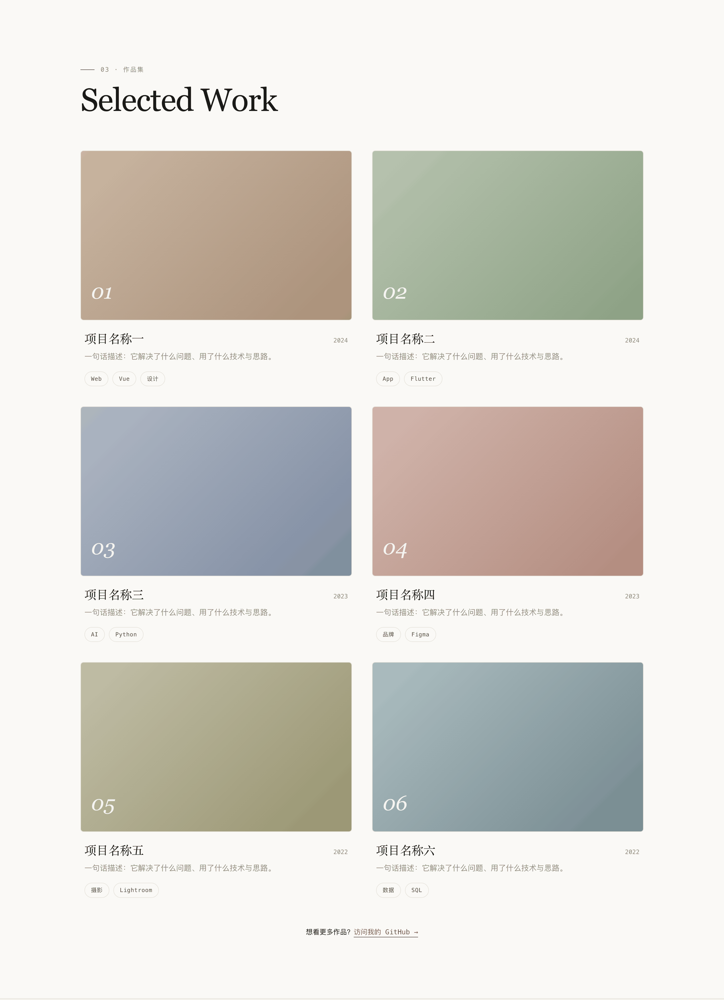
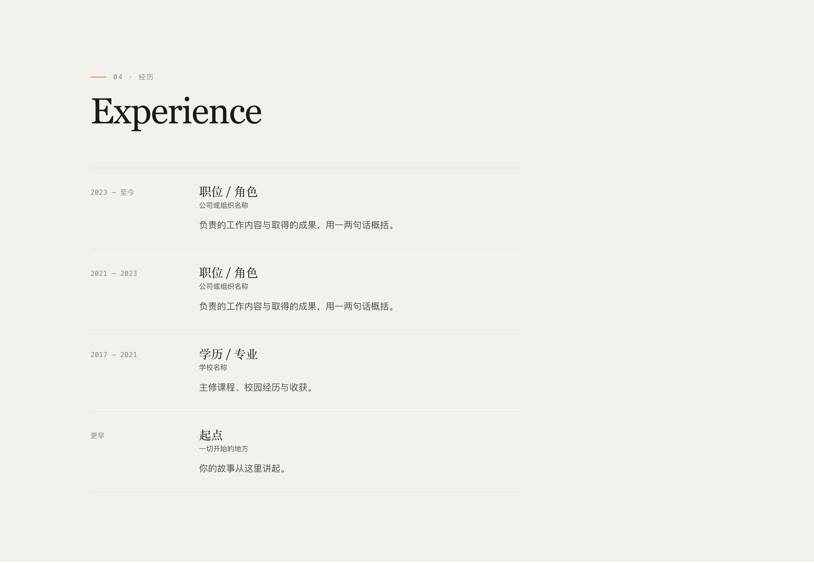
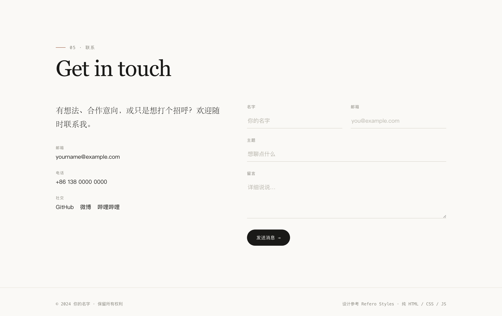
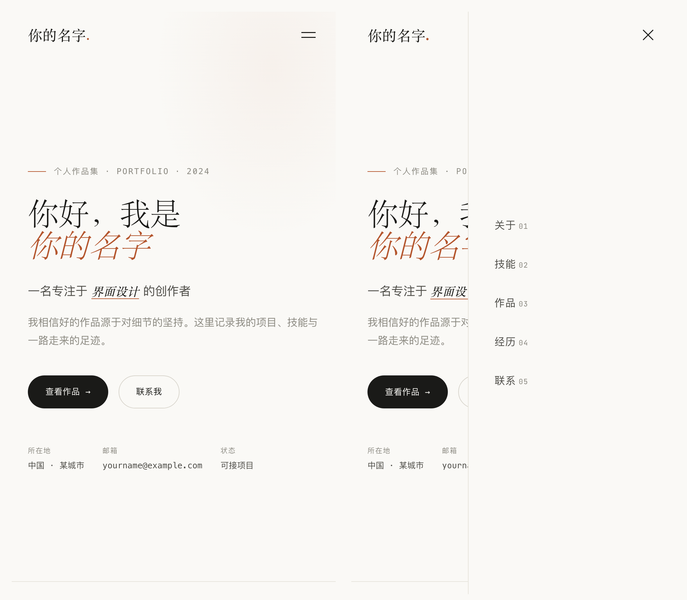

# 个人作品集 · 单页站点

一个零依赖、手写的编辑排版风（editorial）个人作品集单页。暖纸底色、衬线大标题、等宽标签、发丝线分隔 —— 不用任何框架、构建工具或 CSS 库，三个文件、约 30 KB 就跑起来。

`HTML` · `CSS` · `JavaScript` · 无构建 · 无依赖 · 已通过 GitHub Pages 上线

**在线预览 → [tao716.github.io/ty-personal-website](https://tao716.github.io/ty-personal-website/)**

> [!IMPORTANT]
> **当前状态：结构与样式已完成，正文仍是模板占位符。**
>
> 页面骨架、设计系统、交互和响应式都已经做好并上线了，但正文内容还没填 —— 姓名显示为 `你的名字`、邮箱是 `yourname@example.com`、六个作品叫 `项目名称一` 到 `项目名称六`、经历写的是 `公司或组织名称`。全站共 **29 处占位符**，本文档最后一节 [内容填充清单](#内容填充清单) 按行号逐一列出了改哪里。
>
> 下面的截图是站点当前的真实渲染结果，所以你会在图里看到这些占位文字。



---

## 这个项目是什么

一个纯静态的单页作品集模板，五个板块（关于 / 技能 / 作品 / 经历 / 联系）加导航和页脚，滚动式浏览。

它的取向是「不装」：没有 npm、没有打包、没有 Tailwind、没有 jQuery，也没有任何 polyfill。全部代码就是三个文件：

| 文件 | 大小 | 内容 |
|---|---|---|
| `index.html` | 13.0 KB | 页面结构与全部文案 |
| `style.css` | 14.0 KB | 设计系统、五个板块样式、响应式 |
| `script.js` | 3.0 KB | 五个交互行为 |

唯一的外部依赖是 Google Fonts 的三个字体（下面「当前边界」有说明）。把仓库 clone 下来直接双击 `index.html` 就能看，不需要装任何东西。

---

## 设计取向

整套视觉不是靠色彩和阴影堆出来的，而是靠**字体对比**和**留白节奏**。具体的取舍：

| 设计决策 | 实现方式 |
|---|---|
| 暖纸底色而非纯白 | `#faf9f6` 打底，`#f3f1eb` 用于隔行板块，避免屏幕直白刺眼 |
| 标题用衬线、正文用无衬线 | 大标题 Fraunces（可变字重 300–700），正文 Inter，形成明显的层次落差 |
| 标签与数字用等宽字体 | JetBrains Mono 承担 eyebrow、编号、标签、日期，制造「档案感」 |
| 强调色克制使用 | 陶土暖棕 `#b4552d` 只用在 Hero 斜体名字、eyebrow 短横线、时间线机构名、hover 态 |
| 用发丝线代替卡片阴影 | `1px #e7e4dc` 分隔一切；阴影只在作品卡 hover 时出现 |
| 板块编号外显 | `01 · 关于我`、`02 · 技能`…… 导航里也带 `01`–`05`，强化目录感 |
| 中英双标题 | 中文小字 eyebrow + 英文大标题（About / Skills / Selected Work / Experience / Get in touch） |

---

## 页面结构

五个板块，隔行用 `--paper-tint` 交替底色，形成呼吸节奏。

| # | 板块 | 内容与布局 |
|---|---|---|
| — | 顶部导航 | 固定定位，滚动 30px 后加毛玻璃背景与底部发丝线；带板块编号；滚动自动高亮当前板块 |
| — | Hero | 全屏高度，超大衬线标题 + 关键词轮换 + 双按钮 + 三项元信息（所在地 / 邮箱 / 状态） |
| 01 | 关于我 | 左侧 4:5 肖像框，右侧自述 + 四项信息表 + 下载简历按钮 |
| 02 | 技能 | 五行清单，`编号 / 名称 / 工具标签` 三列对齐；hover 时整行左移并变白底 |
| 03 | 作品集 | 2 列 6 张卡片，16:10 渐变缩略图 + 标题 + 年份 + 一句话 + 标签胶囊；hover 上浮 6px |
| 04 | 经历 | 时间线，`日期 / 内容` 两列，共四条（含学历与「起点」） |
| 05 | 联系 | 左侧联系方式，右侧留言表单（下划线式输入框） |
| — | 页脚 | 版权 + 技术说明 |

### 关于我



肖像位现在是一个渐变占位块。`index.html:70` 留了一行注释，把它换成 `` 就行，外框已经锁定 4:5 比例并裁切溢出。

### 技能



用三列对齐的清单而非常见的百分比进度条 —— 进度条要求「我 CSS 掌握 80%」这种无法验证的自评，清单只陈述工具，更诚实也更耐看。

### 作品集



六张卡片的缩略图是六个手调的 CSS 渐变（`style.css:460-465`），暖棕 / 灰绿 / 灰蓝 / 粉褐 / 橄榄 / 青灰，同一套低饱和度基调。这样在没有真实项目截图之前，页面也不会出现裂图或灰色方块。

### 经历



### 联系



输入框只保留下划线，聚焦时下划线变成强调色，和整页的发丝线语言一致。

---

## 设计系统

所有设计变量集中在 `style.css:6-25` 的 `:root` 里，改配色只需要动这一处：

| 变量 | 值 | 用途 |
|---|---|---|
| `--paper` | `#faf9f6` | 页面底色（暖纸） |
| `--paper-tint` | `#f3f1eb` | 隔行板块底色 |
| `--card` | `#ffffff` | 卡片 / hover 底色 |
| `--ink` | `#1a1a18` | 主文字（近黑而非纯黑） |
| `--ink-soft` | `#4d4c47` | 次级文字 |
| `--muted` | `#8a887f` | 弱化文字、标签 |
| `--line` | `#e7e4dc` | 发丝线边框 |
| `--line-strong` | `#d8d4ca` | 输入框、按钮描边 |
| `--accent` | `#b4552d` | 陶土暖棕强调色 |
| `--font-serif` | Fraunces → Georgia → Songti SC | 全部标题 |
| `--font-sans` | Inter → PingFang SC → 微软雅黑 | 正文 |
| `--font-mono` | JetBrains Mono → SFMono → Menlo | 标签、编号、日期 |
| `--radius` | `6px` | 统一圆角（按钮除外，按钮用 `999px` 胶囊） |
| `--ease` | `cubic-bezier(.22,.61,.36,1)` | 统一缓动曲线 |

字体栈都配了中文兜底（Songti SC / PingFang SC / 微软雅黑），所以即使 Google Fonts 加载失败，中文排版也不会掉成默认宋体。

---

## 交互实现

`script.js` 一共五个行为，全部原生实现，没有引入任何库：

| 行为 | 实现 | 位置 |
|---|---|---|
| 导航栏滚动变化 | 滚动超过 30px 时给 header 加 `.scrolled`，触发毛玻璃背景 | `script.js:6-10` |
| 移动端抽屉菜单 | 汉堡按钮切换 `.open`；点击任意导航项自动收起 | `script.js:13-26` |
| 当前板块高亮 | 滚动时比对各板块 `offsetTop - 140`，给对应导航项加 `.active` | `script.js:32-45` |
| Hero 关键词轮换 | 四个词每 2.6s 淡出淡入切换（`opacity` 过渡 0.3s） | `script.js:48-63` |
| 滚动浮现动画 | `IntersectionObserver` 阈值 0.12，元素进入视口后上移 24px 淡入，触发后立即 `unobserve` 不重复 | `script.js:66-78` |
| 表单校验 | 阻止默认提交，校验三个必填项，提示后 `reset()` | `script.js:81-98` |

两个值得一提的细节：

- **浮现动画用 `IntersectionObserver` 而不是监听 scroll** —— 不需要每帧计算元素位置，而且触发一次就 `unobserve`，滚回去不会重播。
- **汉堡按钮只用两根线**（不是常见的三根）。展开时两根线分别旋转 ±45° 并各位移 3.75px，正好合成一个 ✕，不需要额外元素或图标字体（`style.css:731-737`）。

---

## 响应式

单一断点 `860px`，切换后的变化：



左图是收起状态（右上角汉堡按钮），右图是展开状态 —— 抽屉从右侧滑入，占 `min(320px, 78%)` 宽度，同时汉堡按钮变成 ✕。

| 元素 | ≥ 860px | < 860px |
|---|---|---|
| 导航 | 横向排列 | 右侧全高抽屉，`right: -100% → 0` 滑入 |
| 关于我 / 联系 | 双栏（`0.9fr 1.1fr` / `1fr 1.2fr`） | 单栏堆叠 |
| 作品集 | 2 列 | 1 列 |
| 技能行 | `64px / 1fr / auto` 三列，标签右对齐 | 两列，标签换行到第二列左对齐 |
| 时间线 | `160px / 1fr` 两列 | 单列，日期在上 |
| 表单姓名邮箱 | 并排 | 上下堆叠 |

> 上面两张窄视口截图是在 500px 宽度下渲染的 —— 无头 Chrome 的窗口宽度下限是 500px，拍不到更窄的画面。500px 仍在 860px 断点之内，所以移动端布局和抽屉菜单的表现是准确的；真机上更窄屏幕的差别只是文字换行位置。

---

## 本地预览

三个文件没有任何构建步骤，直接打开即可：

```bash
git clone https://github.com/Tao716/ty-personal-website.git
cd ty-personal-website
open index.html          # macOS；Windows 用 start，Linux 用 xdg-open
```

如果要测试字体加载和相对路径，用本地服务器更接近线上环境：

```bash
python3 -m http.server 8000
# 然后访问 http://localhost:8000
```

## 部署

已经通过 GitHub Pages 部署在 [tao716.github.io/ty-personal-website](https://tao716.github.io/ty-personal-website/)。推送到 `main` 后自动更新，无需 workflow 配置 —— 因为没有构建产物，Pages 直接托管仓库根目录。

---

## 内容填充清单

**这是使用这个模板要做的主要工作。** 全站 29 处占位符，按板块列出：

### 全局

| 改什么 | 位置 | 当前值 |
|---|---|---|
| 页面标题 | `index.html:7` | `你的名字 · 个人作品集` |
| 页面描述（SEO） | `index.html:6` | 通用描述，建议改成含真实姓名与定位的一句话 |
| 品牌名（左上角） | `index.html:21` | `你的名字` |
| 页脚版权 | `index.html:294` | `© 2024 你的名字` —— 年份也该更新 |

### Hero

| 改什么 | 位置 | 当前值 |
|---|---|---|
| eyebrow 年份 | `index.html:39` | `个人作品集 · Portfolio · 2024` |
| 大标题姓名 | `index.html:42` | `你的名字` |
| 轮换关键词 | `script.js:48` | `["界面设计", "前端开发", "摄影", "品牌创意"]` |
| 一句话自述 | `index.html:46` | 通用文案 |
| 所在地 / 邮箱 | `index.html:53-54` | `中国 · 某城市` / `yourname@example.com` |

### 关于我

| 改什么 | 位置 | 当前值 |
|---|---|---|
| 肖像照片 | `index.html:70-71` | 渐变占位块，第 70 行有替换用的注释 |
| 小标题 | `index.html:76` | `热爱设计、代码与一切美好事物的创造者` |
| 自述两段 | `index.html:78`、`81` | 含 `[你的领域]`、`[项目类型]`、`[兴趣爱好]` 三处待填 |
| 信息表四项 | `index.html:84-87` | 姓名 / 所在地 / 语言 / 邮箱 |
| 简历文件 | `index.html:89` | `href="#"`，需指向真实 PDF |

### 技能

`index.html:103-127`，五行的名称与工具标签。当前是设计 / 前端 / 后端 / 摄影 / 剪辑，换成自己的领域即可，行数可增删。

### 作品集

`index.html:140-205`，六张卡片各需要改五处：链接、标题、年份、一句话描述、标签。

| 卡片 | 标题行 | 链接行 |
|---|---|---|
| 01 | `index.html:144` | `index.html:140` |
| 02 | `index.html:155` | `index.html:151` |
| 03 | `index.html:166` | `index.html:162` |
| 04 | `index.html:177` | `index.html:173` |
| 05 | `index.html:188` | `index.html:184` |
| 06 | `index.html:199` | `index.html:195` |

底部的「访问我的 GitHub」在 `index.html:208`，也是 `href="#"`。

想换掉渐变缩略图就把 `.work-thumb` 里的 `<span>` 换成 ``，外框已经锁定 16:10 并裁切溢出。

### 经历

`index.html:221-252`，四条时间线，每条三处：日期、职位/角色、机构名（`公司或组织名称` × 2、`学校名称` × 1）与描述。

### 联系

| 改什么 | 位置 | 当前值 |
|---|---|---|
| 邮箱（含 `mailto:`） | `index.html:268` | `yourname@example.com` |
| 电话（含 `tel:`） | `index.html:269` | `+86 138 0000 0000` |
| 社交链接 | `index.html:272` | GitHub / 微博 / 哔哩哔哩，三个都是 `href="#"` |

---

## 当前边界

诚实列一下这个版本还没做的事：

- **11 处 `href="#"` 死链** —— 简历下载、六张作品卡、GitHub 入口、三个社交链接（`index.html` 第 89、140、151、162、173、184、195、208、272 行）。
- **留言表单没有后端**。提交只做前端校验然后弹一个 `alert`，数据不会发到任何地方。`script.js:93-94` 留了接入位置的注释，接 Formspree 之类的服务或自己的接口都可以。
- **字体依赖外部网络**。Fraunces / Inter / JetBrains Mono 从 Google Fonts 加载，网络不通时会回退到系统字体（中文兜底已配好，视觉会变但不会崩）。要完全离线就把字体文件下到仓库里自托管。
- **没有处理 `prefers-reduced-motion`**。滚动浮现和关键词轮换对动效敏感的用户不会自动关闭，这是可访问性上应该补的。
- **抽屉菜单缺 `aria-expanded` 与焦点管理**。汉堡按钮有 `aria-label`，但展开状态没有告知辅助技术，打开后焦点也没有锁在抽屉内。
- **没有 favicon、没有 Open Graph 标签**。分享到社交平台时不会有预览卡片。
- **年份写死为 2024**，Hero 的 eyebrow 和页脚都需要更新。
- **没有测试、没有 CI**。纯静态页面，改完靠肉眼验证。

---

## 致谢

视觉取向参考 [Refero](https://refero.design/) 上收录的编辑排版风站点。字体来自 Google Fonts：[Fraunces](https://fonts.google.com/specimen/Fraunces)、[Inter](https://fonts.google.com/specimen/Inter)、[JetBrains Mono](https://fonts.google.com/specimen/JetBrains+Mono)。
